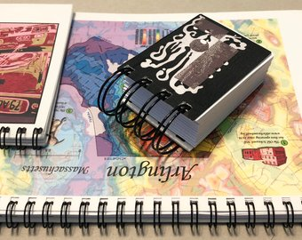

Create Your Own Small Spiral Notebooks
######################################

Introducing Small Spiral Notebooks
==================================
<text TBD, mention these steps are for |LLC| procedures>

<why calling them small>

<notebook versus notebooks for this document>

You can buy these notebooks already made at |etsyNotebooks| or by emailing |emailInfoLLC|.

Why Make Your Own Small Spiral Notebooks?
=========================================
<text TBD><why I am providing this document>

Sizes and Styles
================

|lla| offers the following sizes and styles of spiral notebooks:

.. list-table::
   :widths: 20 30 25 25
   :header-rows: 1

   * - #
     - Size
     - Short Side
     - Long Side
   * - #1
     - |szNm1|
     - |szTrimShort1|
     - |szTrimLong1|
   * - #2
     - |szNm2|
     - |szTrimShort2|
     - |szTrimLong2|
   * - #3
     - |szNm3|
     - |szTrimShort3|
     - |szTrimLong3|
   * - #4
     - |szNm4|
     - |szTrimShort4|
     - |szTrimLong4|
   * - #5
     - |szNm5|
     - |szTrimShort5|
     - |szTrimLong5|
   * - #6
     - |szNm6|
     - |szTrimShort6|
     - |szTrimLong6|

Notebooks come in two thicknesses:

* |Thin| notebooks have approximately |thinPgs| sheets.
* |Chunky| notebooks have approximately |chunkyPgs| sheets.

Additional Style Choices:

* The **orientation** of the image on front can be *vertical* or *horizontal*.
* The **wire spirals** can be placed either on the *top* or on the *left* side.

Steps to Create Your Own Small Spiral Notebooks
===============================================
Click on the steps below to create your own spiral notebooks. You can follow all the steps in sequence without stopping, or you can do some steps and then wait until later to complete the notebooks:

|Contents|

.. toctree::
   :maxdepth: 2

   01_prepare_front_cover.rst
   02_prepare_back_cover.rst
   03_prepare_inner_content.rst
   04_prepare_wire_spiral.rst
   05_combine_the_parts.rst
   06_assemblingAndFinishing_the_notebook.rst
   07_packaging_the_notebook.rst
   08_next_steps.rst

.. add new files to list above to include them in toc
